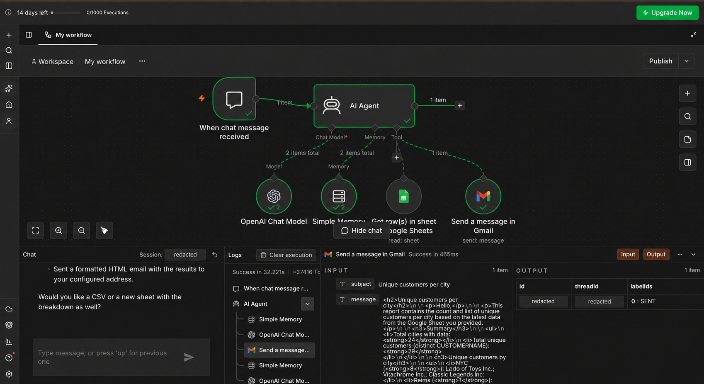
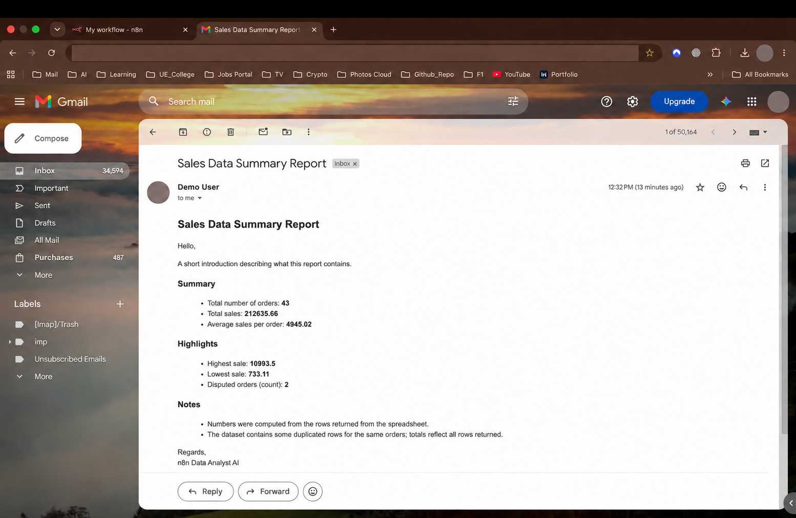
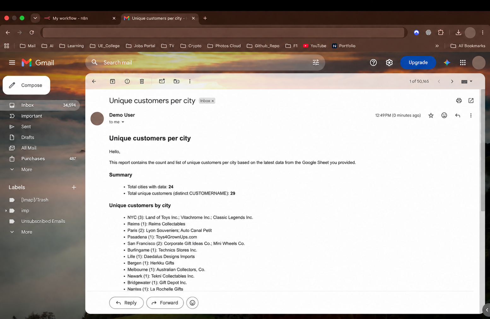

# AI Data Analyst Agent for n8n

An AI-powered data analyst built in [n8n](https://n8n.io/) that reads sales data from Google Sheets, answers natural-language questions, and emails polished HTML reports through Gmail.



## What it does

- Accepts business questions through n8n Chat.
- Retrieves the latest spreadsheet rows with the Google Sheets tool.
- Uses an OpenAI chat model to analyze the data and explain the results.
- Keeps short-term conversational context with n8n Simple Memory.
- Sends requested analyses as structured HTML reports through Gmail.

## Example questions

- What are total sales and average sales per order?
- Which cities have the most unique customers?
- Which product lines generate the most revenue?
- Which orders are disputed?
- Email me a summary of these findings.

## Example outputs

| Sales summary | Customers by city |
| --- | --- |
|  |  |

## Architecture

```text
User question
    |
    v
n8n Chat Trigger ---> AI Agent <--- Simple Memory
                         |
                  OpenAI Chat Model
                         |
             +-----------+-----------+
             |                       |
             v                       v
      Google Sheets tool        Gmail tool
      (retrieve rows)       (send HTML report)
```

See [Architecture](docs/architecture.md) for the processing flow and design decisions.

## Repository contents

```text
.
├── workflows/
│   └── ai-data-analyst-agent.json
├── sample-data/
│   └── sales-data-sample.csv
├── screenshots/
│   ├── workflow-overview.png
│   ├── sales-summary-report.png
│   └── customer-city-report.png
├── docs/
│   ├── architecture.md
│   └── setup.md
├── .env.example
├── .gitignore
├── LICENSE
└── README.md
```

## Quick start

1. Download or clone this repository.
2. In n8n, choose **Import from File** and select `workflows/ai-data-analyst-agent.json`.
3. Connect your OpenAI, Google Sheets, and Gmail credentials in n8n.
4. Replace `YOUR_GOOGLE_SHEET_ID`, `Sheet1`, and `you@example.com` in their respective nodes.
5. Test the workflow with the included sample data, then activate it.

Detailed instructions are in [Setup](docs/setup.md).

## Sample data

The included CSV has 43 example sales rows with order, product, customer, location, and revenue fields. Upload it to Google Sheets to reproduce the demonstrated analyses.

> The sample is for demonstration only. Review any dataset for personal or confidential information before connecting it to an AI workflow.

## Security and privacy

The public workflow is a sanitized export. It contains no API keys, OAuth tokens, credential IDs, personal email addresses, n8n instance identifiers, webhook identifiers, or private Google Sheet URLs. Screenshots are also redacted for public sharing.

Credentials remain managed by n8n and must be connected after import. Never commit `.env` files, credential exports, execution logs, or unsanitized workflow exports.

## Tech stack

- n8n
- OpenAI chat model
- Google Sheets
- Gmail
- n8n LangChain Agent and Simple Memory nodes

## License

Released under the [MIT License](LICENSE).
